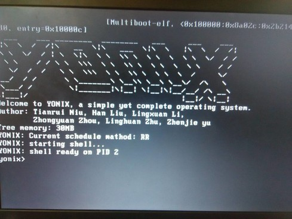

# yonix开发文档-boot&mem

[TOC]

## 1. 引导

由于原本就是按照裸机启动的要求实现的操作系统，引导则是必须的。

一般而言，目前的linux操作系统都是采用grub(2)引导的，大体分为两步：

1. 加载内核
2. 加载文件系统

对于安装到磁盘的操作系统，只需要加载磁盘根目录即可完成加载文件系统；

但是对于live启动的操作系统来说，没有安装好的文件系统，因此，linux在加载kernel后，一般会利用`initrd`命令加载一个initrd文件，这一步实际上就是在内存中开辟一段空间，用于构建文件系统。这也就是为什么一些操作系统光盘live启动无法保存的设置的原因。

我们的操作系统与linux的live启动方式十分相似，只是initrd这一步我们直接放到内核中进行了。在内核中实现了两种文件系统，一种是直接操作磁盘，一种是利用内存模拟磁盘，利用`make kernelmemfs`命令，可以编译出带内存文件系统的内核。引导过程也就只需要一步——引导内核即可。

具体步骤而言，可以借助现成的U盘引导制作工具，在U盘上创建grub，手动修改根目录下的grldr文件为如下：

```grldr
timeout 5
gfxmenu (ud)/ILMT/GRUB/MESSAGE
configfile (md)4+8
title “启动yonix”
kernel (hd0,0)/yonix/kernelmemfs
```

另外，引导上借助了`gfxmenu`实现开机logo，利用`gfxmenu tool`等工具手动创建message文件，可以设置grub引导过程界面。




## 2. 内存管理

内存管理部分主要分为三个部分：页表管理、物理内存分配、交换空间管理

### 2.1 页表管理

操作系统页表主要分为两部分：

- 临时页表`entrypgdir`
- 二级页表

#### 2.1.1 临时页表

##### 2.1.1.1 原理

系统启动过程应该从`entry.S`开始，后续加载`main.c`开始正式执行我们的代码。在`main.c`中刚开始，由于还没有执行我们的分页程序，内核使用`entrypgdir`简化页表访问物理内存，且物理内存只有低4MB可以使用，也就是[0, 4MB)。

具体映射关系是 逻辑地址 -> 物理地址：`[2G，2G+4M)-> [0, 4MB)` 。

具体而言，操作系统从`entry.s`的`entry`区段开始引导内核，首先便需要启动临时分页机制，通过设置控制寄存器CR0-CR4完成。

1. 设置分页大小为4MB，通过设置CR4寄存器标志位完成。

```asm
# Turn on page size extension for 4Mbyte pages
  movl    %cr4, %eax
  orl     $(CR4_PSE), %eax
  movl    %eax, %cr4
```

2. 设置页表目录物理基地址，系统设置CR3寄存器高20位存储页表物理地址。之所以是20位，因为物理内存按页分配，只需要找到页表所在物理页的基地址即可。

```asm
# Set page directory
  movl    $(V2P_WO(entrypgdir)), %eax
  movl    %eax, %cr3
```

3. 设置CR0寄存器开启分页机制和内存保护。

```asm
# Turn on paging.
  movl    %cr0, %eax
  orl     $(CR0_PG|CR0_WP), %eax
  movl    %eax, %cr0
```

##### 2.1.1.2 结构

其中，具体的临时页表`entrypgdir`如下所示：

```asm
__attribute__((__aligned__(PGSIZE)))
pde_t entrypgdir[NPDENTRIES] = {
  // Map VA's [0, 4MB) to PA's [0, 4MB)
  [0] = (0) | PTE_P | PTE_W | PTE_PS,
  // Map VA's [KERNBASE, KERNBASE+4MB) to PA's [0, 4MB)
  [KERNBASE>>PDXSHIFT] = (0) | PTE_P | PTE_W | PTE_PS,
};
```

这里的初始化数组方法并不常用，直接给具体某个数组元素赋初值。由于之前在`entry.s`中开启了4MB分页，MMU自动调整为一级分页，高10位为页面号，低22位为页内偏移。

具体来说，`KERNBASE>>PDXSHIFT`相当与提取了`KERNBASE`的页面号，其页表项对应物理地址为0，后面三个为flag标志。这样一来，也就实现了 [KERNBASE, KERNBASE+4MB) 到[0, 4M)的映射。

#### 2.1.2 二级页表

##### 2.1.2.1 原理

进入`main.c`后首要任务就是加载我们的页表机制，但是这里出现了一种‘死锁’：我们无法访问物理内存，于是我们需要构建二级页表来访问物理内存，但页表又是存储在物理内存中的某一页上。因此可以看到在`main.c`中初始化页表分成了两个部分，`kinit1`和`kinit2`。

- `kinit1`利用之前的`entrypgdir`机制在内核后面申请内核结束到物理地址为4MB的空间，用来存储第一个正式的内核页表，并及时切换临时页表到该内核页表，使得整个物理地址空间都可以访问。
- `kinit2`将最开始物理内存4MB以后的所有地址重新分配，全部加入空闲页链表中。

> 这里对物理空闲页的管理实际上就是内存池算法，将所有空闲页组织成链表

##### 2.1.2.2 映射关系

| 虚拟地址                      | 物理地址                          |
| ------------------------- | ----------------------------- |
| 0..KERNBASE               | 用户程序申请，内核帮助分配到的内存             |
| KERNBASE..KERNBASE+EXTMEM | I/O内存空间0..EXTMEM              |
| KERNBASE+EXTMEM..data     | 内核内存空间EXTMEM..V2P(data)       |
| data..KERNBASE+PHYSTOP    | 内核内存V2P(data)..PHYSTOP，以及空闲内存 |
| 0xfe000000..0             | 直接映射为其他设备地址                   |

##### 2.1.2.3 结构

具体二级页表如下：

页目录10位，页表10位，页内偏移12位。

```c
// A virtual address 'la' has a three-part structure as follows:
//
// +--------10------+-------10-------+---------12----------+
// | Page Directory |   Page Table   | Offset within Page  |
// |      Index     |      Index     |                     |
// +----------------+----------------+---------------------+
//  \--- PDX(va) --/ \--- PTX(va) --/
```

页表项分为高20位和低12位，分别存储物理页号和flag标志。通过如下宏定义转化。

```c
// Address in page table or page directory entry
#define PTE_ADDR(pte)   ((uint)(pte) & ~0xFFF)
#define PTE_FLAGS(pte)  ((uint)(pte) &  0xFFF)
```

##### 2.1.2.4 内核与用户进程

在操作系统启动完成后，应该包含唯一一个内核页表，以及若干个用户进程页表。

其中，内核页表包括整个物理地址空间的所有映射，目的就是使得操作系统可以访问到任意一个物理地址。

而多个用户页表则是为了使得用户进程之间虚拟地址相互独立，每一个用户进程都可以使用0-0x80000000的虚拟地址，互不干扰。而用户页表中，一方面包含了内核页表的所有映射，目的是当操作系统加载的是用户页表时，仍然能够通过MMU映射到所有物理地址；另一方面，用户页表还包含了内核帮助分配的内存页映射，使得用户进程可以利用其用户虚拟地址进行访问。

### 2.2 物理内存分配

物理内存分配主要是帮助管理空闲内存，并提供空闲页申请和释放算法。

#### 2.2.1 内存池算法

在构建页表结束后，无论是临时页表还是二级页表，都可以保证操作系统访问到一定的物理地址空间，对于这一部分物理内存，我们采用空闲页链表的方式进行管理。

##### 2.2.1.1 结构

在每一个空闲页中构建结构体如下，包含页大小和next指针。

```c
struct fpage
{
	uint size; 	// 页大小
	struct fpage *next;
};
```

在临时页表中，页面大小为4MB；在二级页表中，页面大小为4KB。而该结构体只占8bytes，因此每一个页面都能满足结构体的存储要求。

内存池如下：

```c
struct
{
	uint nfreeblock;	// 空闲页个数
	struct fpage *freelist;
} kmem;
```

##### 2.2.1.2 维护算法

- 初始化
  - 内存页对齐后，每一页调用页释放算法
- 申请
  - 从空闲页链表中取出一页并返回
- 释放
  - 在对应页地址构建结构体并加入内存池（空闲页链表）

> 注意，这里页面所有使用的内存地址均为内核级虚拟地址，也可以认为这些内存都为内核所拥有

#### 2.2.2 简化slab算法

由于在内核中许多算法也需要动态申请物理内存，但又不需要4kb那么大的页，例如构造置换页队列时，队列项结构体都需要动态申请。在linux中，这些都是采用slab伙伴算法，连续申请大内存。对我们而言，这样的动态申请只有几处，综合考虑，32byte已经足够。

这样一来，我们的slab分配算法与上面的内存池算法基本相似，区别如下：

1. slab大小为32byte，而内存页大小为4kb
2. slab是在页基础上申请，而内存页是在物理内存基础上申请

### 2.3 交换空间管理

这一部分主要实现了内存管理中的页置换算法。


####  2.3.1 存储结构

- 交换空间通常会预先设置一个固定大小的swap分区，分区文件系统及底层对该分区读写均与unix结构相同
- 上层将该分区分成若干个slot，每一个slot的大小与页大小相同，为4kb
- 这样一来，在页面换入、换出过程中，只需要将对应页写入对应slot即可

```c
#define SWAPSIZE 0x8000000  		// 128MB swap area
#define SLOTSIZE SWAPSIZE/PGSIZE  	// number of slots
```

#### 2.3.2 映射关系

在内核中，维护一个页面与slot的映射表（如下所示），由于每一个页面有一个不重复的物理地址，也就是一个可以唯一标示该页面的内核级虚拟地址（具体原因可以参考虚存部分）。因此可以在该映射表中存储slot对应页面的内核虚拟地址，映射表的索引index可以代表对应的slot。

但是，我们遇到一个问题。在操作系统中，经常需要对一个进程的所有页面进行操作，例如，如果需要销毁一个进程，那么就必须要找出该进程所对应的所有内存页和换出的slot，进行释放。这样一来，如果我们仍然采用内核级虚拟地址来唯一标示一个页面，势必是极其繁琐的。因此，寻求一种简洁、高效的标识页面方法成了当下的问题所在。

这里，我们采取了一种比较巧妙的手段。我们知道，一个被分配的内存页具有一个用户级的虚拟地址（0-0x80000000），但是这个虚拟地址可能会在多个用户进程中重复出现，因此不能直接使用。聪明的开发者可能已经发现了，由于是页面地址，因此这个用户级的虚拟地址是页对齐的，也就是说其低12位均为0；另外，每一个进程具有一个唯一的标识符——pid。于是，我们可以将这个用户级的虚拟地址与pid号按位与运算，也就是将进程pid号对应到用户级虚拟地址的低12位。

这样一来，我们的交换空间映射表就变成了存储有`vm|pid`的数组结构。

> 注意，这种方法限制了用户进程pid最大不能超过1<<12 - 1，也就是4095。但是如果我们在进程pid管理上处理得当，操作系统同时最大运行的进程数也就是4096，目前来看，这远远满足了我们的需求。

```c
uint swap_map[SLOTSIZE]; 
```

#### 2.3.3 页置换算法

这里借助队列实现了FIFO和second chance算法。

##### 2.3.3.1 数据结构

这两个页面置换算法均可以采用队列实现，因此构建一个内存页队列当是关键所在。

队列的每一项是一个结构体，包含对应页表项地址（应是一个大于0x80000000的内核虚拟地址），对应页面用户虚拟地址按位与pid，引用位，next指针。

```c
struct page_entry
{
	pte_t *ptr_pte;	// 页表项地址
	uint pn_pid; 	// 页号按位与pid，作为交换区页标识符
	uint ref;		// 引用位, 用于二次机会算法
	q_entry link;	// next指针
};
```

> 这里借助了NetBSD的queue.h头文件，帮助实现队列结构

##### 2.3.3.2 换入页

当发生内存页错误时，进行如下操作：

1. 在物理内存申请一页
2. 用发生错误虚地址按位与pid，从交换空间映射表查找对应slot
3. 将slot内容写入内存，并释放slot
4. 在用户页表中查找发生错误页虚地址对应的页表项
5. 更新页表项

##### 2.3.3.3 换出页

换页大体步骤对于两种置换算法都相同，如下所示：

1. 选择合适的待置换页
2. 修改该页对应页表项
3. 在交换空间申请一个slot
4. 将内存页写入slot
5. 从内存和页队列释放置换页

对于第一步，两种置换算法不同做法如下：

- FIFO

  在每一个用户进程申请内存页的时候均需要添加到置换页队列尾，但是对于某些内核进程而言，申请内存页则不需要添加到页队列。这一点的目的为了保护内核。

  这样一来，每次我们选择置换页的时候，只需要从置换页队列头取一页即可。

- second chance

  二次机会算法在选择页队列则稍复杂一些，在维护置换页队列的基础上，同时需要更新页面的引用位。

  在硬件基础上，cpu会自动帮我们填充页面引用位为1，但不会置0。因此，我们只需要在每一个进程调度开始的时候手动将所有页面引用位置为0，而在调度结束时候，从内存中将所有页面引用位读取到置换页队列中即可。

  这样一来，置换页队列中的页面引用位可以代表对应页最近的最近的使用程度。在选择置换页的时候，只需要循环遍历置换页队列，遇到引用位为1，就手动置0，遇到引用位为0，就选择该页换出。

  ​

刘含
liuhan132@foxmail.com
更新于 2017/5/7